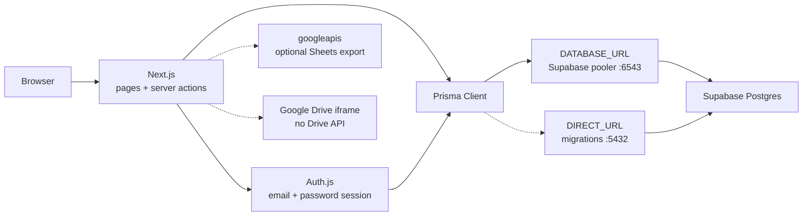

# Tech stack

What every piece of **OneLegends** is, and **why it is there**. This is not a shopping list of trendy tools — each row exists because a real job in the product needs it.

**Docs:** [README](README.md) · [SETUP](SETUP.md) · [SUAV](SUAV.md) · [COMP_CODES](COMP_CODES.md)

## Picture of a request

The site is a **Next.js app**. Login is **this app’s Auth.js**, not Supabase Auth. Data lives in **Supabase Postgres**. Prisma is the **SQL translator** (schema, migrations, queries). Google Sheets is optional. Google Drive is only used as a **public video host** (embed / open link).

---

## Runtime

| Piece | Version / pin | Used for |
| --- | --- | --- |
| **Node.js** | 22 in `.nvmrc` (engine `>=20.9`) | Runs Next, Prisma CLI, seed scripts. This is a Node app, not Python. |
| **nvm** | optional, recommended | Switches this repo to the pinned Node so everyone is on the same runtime. |
| **npm** | comes with Node | Installs packages into `node_modules`. `package-lock.json` locks versions. |
| **macOS / Linux / Windows** | any | Local `next dev`. No Docker, no Homebrew Postgres, no local database. |

---

## App framework

| Piece | Package | Used for |
| --- | --- | --- |
| **Next.js (App Router)** | `next` 16 | The whole website: routes under `src/app/`, HTML rendering, server actions (`"use server"`), the `/api/auth/*` login endpoints. |
| **Turbopack** | bundled with `next dev` | Fast local rebuilds. You do not configure it separately. |
| **React** | `react` / `react-dom` 19 | UI components (forms, nav, score sheets). Server Components fetch data; Client Components handle clicks and inputs. |
| **TypeScript** | `typescript` | Types for pages, actions, Prisma models. Catches wrong fields before runtime. |
| **path alias `@/`** | `tsconfig.json` | Imports like `@/lib/prisma` → `src/lib/prisma`. |

**Not used:** Next.js middleware file, a separate REST API, a Python backend.

---

## Database (Supabase + Prisma)

| Piece | Package / product | Used for |
| --- | --- | --- |
| **Supabase** | hosted Postgres only | The **only** database. Users, team profiles, dancers, competition listings, applications, judge packets, scores. Project is a normal Postgres instance we connect to with a URI. |
| **Postgres** | via Supabase | Tables, unique constraints (one application per team per comp), foreign keys that delete scores when a team is wiped. |
| **Prisma schema** | `prisma/schema.prisma` | The source of truth for tables and relations. Edit this, then migrate. |
| **Prisma Migrate** | `prisma` CLI | Turns schema changes into SQL in `prisma/migrations/`, then applies them to Supabase (`npm run db:migrate` / `npx prisma migrate deploy`). Uses `DIRECT_URL` (port **5432**) because migrations cannot run through transaction pooling. |
| **Prisma Client** | `@prisma/client` | TypeScript queries in the app (`prisma.user.findUnique`, `create`, etc.). Generated on `npm install` (`postinstall`) and before `next build`. Uses `DATABASE_URL` (port **6543**, `pgbouncer=true`) so many serverless-style queries do not exhaust connections. |
| **Prisma seed** | `tsx prisma/seed.ts` | Wipes app rows, restores bid listings, and seeds the Legends Admin ops account. Run with `npm run db:seed`. |

**Two URLs, one database**

| Env var | Port | Used for |
| --- | --- | --- |
| `DATABASE_URL` | **6543** transaction pooler | Live app queries. |
| `DIRECT_URL` | **5432** session / direct | `migrate` and anything that needs a real Postgres session. |

**Not used from Supabase:** Auth, Storage, Realtime, Edge Functions, Row Level Security as the app’s permission layer, or `@supabase/supabase-js`. Do not paste the Next.js / anon `eyJ…` keys into `.env` — those are for the JS client. This app needs the **Postgres URI**.

**Do not** run `prisma migrate reset` on Supabase (it tries to drop the whole database). To empty app data, seed again.

---

## Auth (Auth.js, not Supabase Auth)

| Piece | Package | Used for |
| --- | --- | --- |
| **Auth.js (NextAuth v5)** | `next-auth` | Email + password login, signed session cookie, `auth()` in server layouts/actions, `signIn` / `signOut`. Config: `src/auth.ts`. HTTP handlers: `src/app/api/auth/[...nextauth]/route.ts`. |
| **Credentials provider** | same | We look up `User` by email and compare the password hash. There is no Team / Comp / Judge radio and no Google/GitHub login. Access is added after login with a claim code or an email invite. |
| **JWT session** | `session: { strategy: "jwt" }` | After login, the browser holds a signed JWT cookie. The JWT callback re-checks that the user row still exists so a seed wipe invalidates old cookies. |
| **`AUTH_SECRET`** | env | Signs/verifies that cookie. Change it before any public deploy (`openssl rand -base64 32`). |
| **`AUTH_URL`** | env | Canonical site URL (local: `http://localhost:3000`). |
| **bcryptjs** | `bcryptjs` | Hashes passwords on register (`hash`) and checks them on login (`compare`). The database stores `passwordHash`, never the raw password. |
| **Password rules** | `src/lib/password.ts` | 10+ chars, upper, lower, number, special. Enforced in register (Zod) and shown in the UI. |
| **Account hub** | `/account` + membership layouts | After login everyone lands on Account. `/team`, `/comp`, and `/judge` layouts check approved memberships or judge assignments, not a role radio. |

**Not used:** Supabase Auth, OAuth, magic links, Auth.js Prisma adapter (we query Prisma ourselves in `authorize`). This app does **not** send email; invites wait on the next login.

---

## Validation and server logic

| Piece | Package / file | Used for |
| --- | --- | --- |
| **Zod** | `zod` | Validates form payloads in server actions (register, team profile, comp details). Returns field errors instead of crashing. |
| **Server Actions** | `src/app/actions/*.ts` | Mutations from the UI without a separate API: register, apply, score, approve judges, sync sheets. Marked `"use server"`. |
| **Claim codes** | `src/lib/claim-code.ts` + `prisma/season-comps.ts` | After login, a team or competition code on Account attaches a primary admin. First valid claim wins. Secondary admins and judges are invited by email (stored in-app, not mailed). |
| **Judging math** | `src/lib/judging.ts` | Rubric 0–10, packet shuffle per judge, z-scores for ranking. No stats library — this is a few functions. |
| **cuid()** | Prisma `@default(cuid())` | String IDs for every row (not autoincrement integers). |

---

## Google (optional / embed only)

| Piece | Package / how | Used for |
| --- | --- | --- |
| **googleapis** | `googleapis` | **Optional** export of applicants to a Google Sheet (`src/lib/sheets.ts`). Needs a Google Cloud **service account**, Sheets API on, sheet shared with that email as Editor. Env: `GOOGLE_SERVICE_ACCOUNT_EMAIL`, `GOOGLE_SERVICE_ACCOUNT_PRIVATE_KEY`. |
| **Google Drive** | URL parse + iframe | Teams paste a Drive **file** link. `src/lib/drive.ts` extracts the file id. `DriveAvPlayer` embeds `drive.google.com/file/d/…/preview`. **No Drive API, no OAuth, no copying files.** Folder links cannot play inline (a folder listing would leak names). |

The site works with both Google env vars empty. Sheets sync then reports that it is not configured.

---

## UI and branding

| Piece | Package / files | Used for |
| --- | --- | --- |
| **Tailwind CSS v4** | `tailwindcss` + `@tailwindcss/postcss` | All layout and color. Tokens in `src/app/globals.css` (`--accent` plum, `--accent-ember`, `--blush`). |
| **PostCSS** | `postcss.config.mjs` | Runs the Tailwind plugin when CSS is built. |
| **Montserrat** | `next/font/google` in `src/app/layout.tsx` | Circuit-matching type, loaded from Google Fonts at build time (not a runtime CSS CDN in the page). |
| **Brand images** | `public/brand/` | Crown in the nav, hero wordmark on Home. Served as static files. |
| **Client forms** | `src/components/*` | Register, roster, apply checkboxes, rubric inputs, sign out. |

Payment is **not** in this product (no Stripe). Status (accept / waitlist / decline) is a column on `Application`.

---

## Tooling (dev only)

| Piece | Package | Used for |
| --- | --- | --- |
| **tsx** | `tsx` | Runs `prisma/seed.ts` as TypeScript without compiling first. |
| **ESLint** | `eslint` + `eslint-config-next` | Lint (`npm run lint`). Core Web Vitals + TypeScript rules. |
| **Prisma generate** | `prisma generate` | Rebuilds `@prisma/client` after schema changes. `postinstall` and `npm run build` both run it. |
| **Type packages** | `@types/node`, `@types/react`, `@types/bcryptjs` | TypeScript types for Node, React, bcrypt. |

---

## Environment variables

| Variable | Required | Used for |
| --- | --- | --- |
| `DATABASE_URL` | yes | App → Supabase pooler. |
| `DIRECT_URL` | yes | Prisma migrate → Supabase session/direct. |
| `AUTH_SECRET` | yes | Signs the Auth.js cookie. |
| `AUTH_URL` | yes | Site origin for Auth.js. |
| `GOOGLE_SERVICE_ACCOUNT_EMAIL` | no | Sheets export identity. |
| `GOOGLE_SERVICE_ACCOUNT_PRIVATE_KEY` | no | Sheets export key (`\n` kept as two characters in `.env`). |

Copy `.env.example` → `.env`. Never commit `.env`. URI-encode special characters in the database password (`@` → `%40`).

---

## Repo map

| Path | What lives there |
| --- | --- |
| `src/app/` | Routes: `/` landing, `/login`, `/register`, `/account`, `/team/*`, `/comp/*`, `/judge/*`, `/api/auth/*`. |
| `src/app/actions/` | Server mutations (auth, team, comp, judging). |
| `src/auth.ts` | Auth.js config (credentials, JWT, session). |
| `src/lib/prisma.ts` | One Prisma Client (reused in dev so hot reload does not open extra connections). |
| `src/lib/sheets.ts` | Optional Google Sheets write. |
| `src/lib/drive.ts` | Parse Drive URLs for the in-page player. |
| `prisma/schema.prisma` | Tables. |
| `prisma/migrations/` | SQL already applied to Supabase. |
| `prisma/season-comps.ts` | Official listing names + claim codes for seed. |
| `public/brand/` | Logos. |

---

## What is not in the stack

- Local Postgres, Docker Compose, Homebrew Postgres
- Supabase Auth / supabase-js
- Python, venv, the old `suav-randomization` script (see [SUAV.md](SUAV.md))
- In-app payments
- A separate backend service
