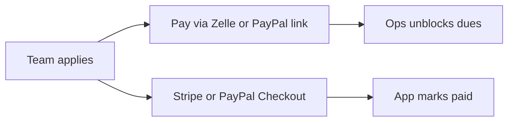

# Free ways to take payment

Google sign-in is already built and stays off until `AUTH_GOOGLE_ID` and `AUTH_GOOGLE_SECRET` are set. It is separate from payments.

The site currently says payment is external. Two different payments show up in the product:

- **Circuit dues.** Ops can block a team from applying ([`src/lib/team-profile.ts`](src/lib/team-profile.ts)). Someone has to decide the dues were paid.
- **Competition application fees.** Copy in [`README.md`](README.md) and [`src/components/ApplyForm.tsx`](src/components/ApplyForm.tsx) says each host handles payment off the site.

“Free” splits in two. A link costs nothing to add and nothing per month. A checkout that marks the team paid by itself is also free to turn on, but PayPal and Stripe still take a percentage of each payment. No mainstream processor both confirms the payment in the app and charges zero.

## Truly free vs minimal cost

Nothing both confirms the payment inside OneLegends and costs the circuit zero. The free options cannot tell the app the money arrived. The cheap confirmed options still take a small cut.

- **$0, no confirmation.** Zelle instructions, a bank account and routing number for a transfer, or a check. Venmo and Cash App person-to-person are usually free too, and they are a poor fit once this is dues or an entry fee. The site shows how to pay. Ops still unblocks the team after they see the money.
- **$0 to the org only in a special case.** Zeffy advertises no platform fee for nonprofits by asking the payer to cover the cost. That fits a donation, not a competition entry fee.
- **Minimal cost, still confirmed.** A bank debit (ACH) through Stripe is about 0.8% and capped around $5 in the US. A $100 dues payment is under a dollar. A card link through Stripe or PayPal is about 3% plus a small fixed fee, with no monthly bill. PayPal’s micropayment rate (about 5% + $0.05) is only cheaper on very small charges.

## Options

- **Zelle, Venmo, Cash App, or PayPal.Me link.** Each competition (and the circuit, for dues) stores a URL or short instructions. The apply screen shows “Pay here” and still submits the application. Ops keeps using the existing block for unpaid dues. Zelle is usually free for the sender through their bank. The site never learns that the money arrived.
- **PayPal payment link or button.** Same idea, with a hosted PayPal page. No monthly fee. Goods-and-services payments are about 3% plus a fixed fee. Friends-and-family is fee-free and is the wrong tool for dues or entry fees; PayPal can limit the account. Later, a webhook could mark a team paid. That is more work than a link.
- **Stripe Payment Link.** No monthly fee. About 2.9% + $0.30 per card payment. A webhook can clear the dues block or record that an application fee was paid. This is the smallest version that is actually connected to the app.
- **Leave it manual.** Keep the current copy and the ops block. Add one circuit dues link on the team dashboard. Hosts keep collecting their own fees however they do now.

## What to do now

Leave checkout, Zelle, and per-competition payment fields for later. Two edits only:

- Add **Payments** to the list in [`docs/feature-implementation.md`](docs/feature-implementation.md), status not built. Note that a free path is a Zelle or PayPal link with ops still marking dues paid, and a minimal-cost path is a bank debit or card link that can confirm payment later. The site does not take money yet.
- In [`src/components/ApplyForm.tsx`](src/components/ApplyForm.tsx), replace “Payment is handled off this site.” with a filler link to `https://www.paypal.com/paypalme/`. Applications still submit. The footer and seed copy stay as they are.

